## Предыстория

В декабре 2021 года моя девушка подарила мне Raspberry Pi 4B 2GB (видимо слишком часто рассказывал ей об этой плате 😄). Сразу же были заказаны все необходимые комплектующие т.к. плата из коробки идет даже без блока питания. Raspberry Pi была в роли слабенького ПК на Raspbian OS, ретро консоли на RetroPie, Android TV правда только с программным кодированием. Когда купил внешний HDD на 2 ТБ я подумал, а почему бы не сделать мини-сервер для бэкапов устройств по сети. Так я установил Raspbian OS без UI, поставил S3 хранилище и OwnCloud.

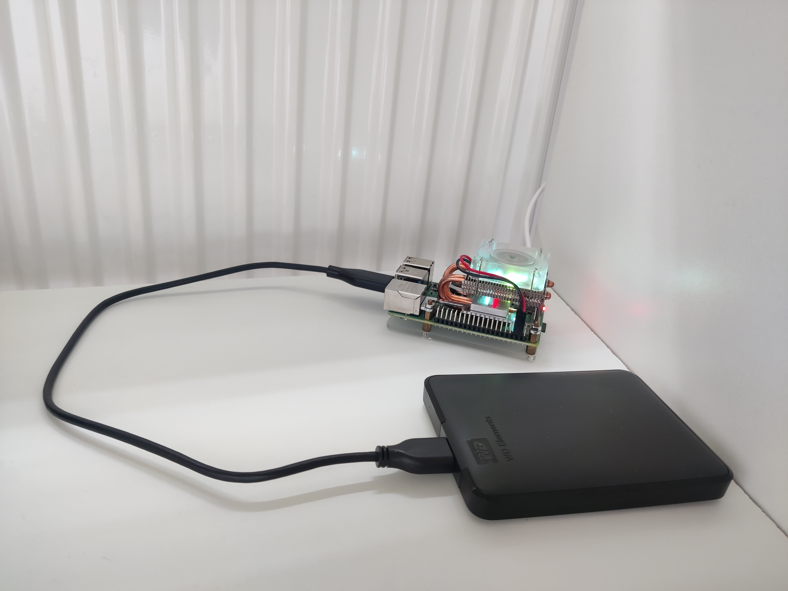

Вот так это выглядело: Raspberry Pi + внешний HDD

 

Для локальных бэкапов такое решение вполне себе, если еще найти корпус, чтобы выглядело красивее. Но есть и минусы. С точки зрения надежности на внешнем диске лучше не хранить ничего важного т.к. нет зеркалирования. Можно было подключить второй такой диск и сделать RAID 1, но выглядело бы это ну очень громоздко и некрасиво. Для архитектуры ARM (да, Raspberry Pi это не x86) бывало не мог найти какое-то ПО. Производительности платы хватало на пару сервисов и расширить RAM было никак нельзя.

Вот это все было развернуто на Raspberry Pi

 

До недавнего времени меня все устраивало, пока я не получил уведомление от Google, что облачное хранилище скоро заполнится. Я бы мог оплатить подписку и получить дополнительные 100GB, но это не мой путь.

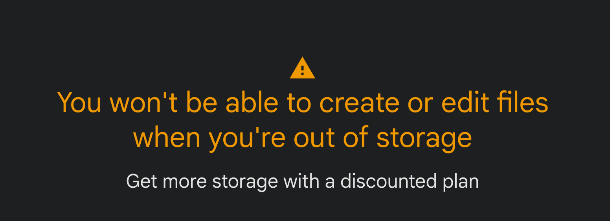

Это, конечно, должно было произойти когда-нибудь

 

## Начало пути

Сначала я хотел купить готовый NAS, но увидев цены передумал. На тот момент я не понимал почему они такие дорогие. За очень слабое железо и корпус такие деньги. Дело в том, что это цена за готовое решение. Пришел домой, включил, вставил диски, протыкал "далее" и у тебя готовое хранилище с доступом из любой точки мира. Если железо позволяет, можно даже поднять сервисы для стриминга и умного хранения фото.

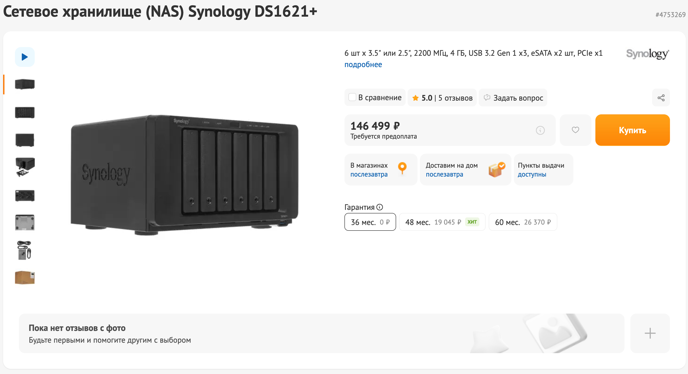

Да, цена, конечно, космос

 

Есть NAS'ы от TerraMaster, они сильно дешевле Synology, но по отзывам ОС там не дотягивает до ОС от Synology, но по железу они вполне неплохие.

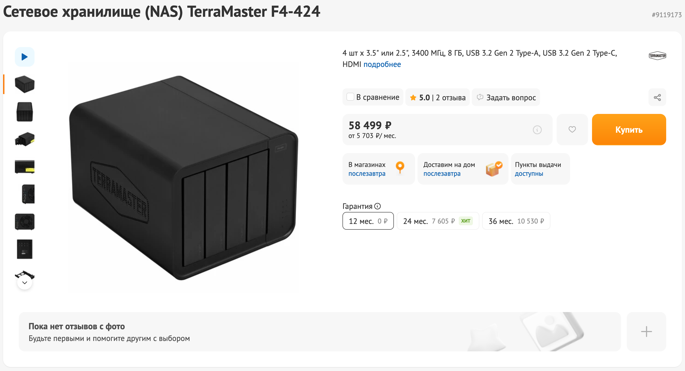

 

Но я не хотел готовое решение, хотелось собрать самому и желательно за небольшие деньги. Сначала я планировал NAS из мини ПК и DAS. DAS отличается от NAS тем, что это просто коробка куда можно вставить диски и подключить ее к ПК по USB.

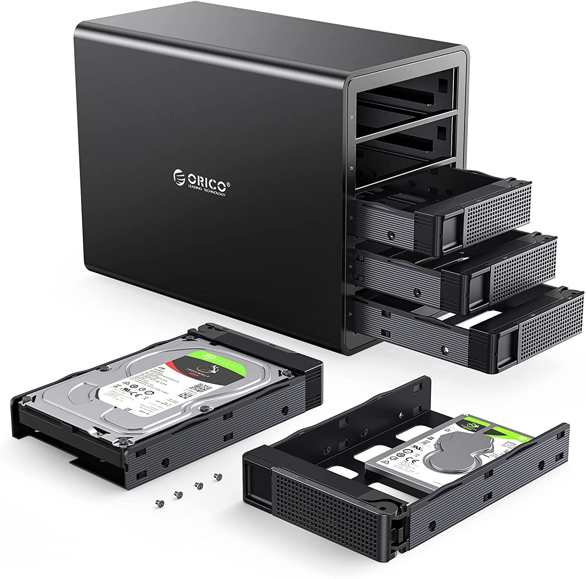

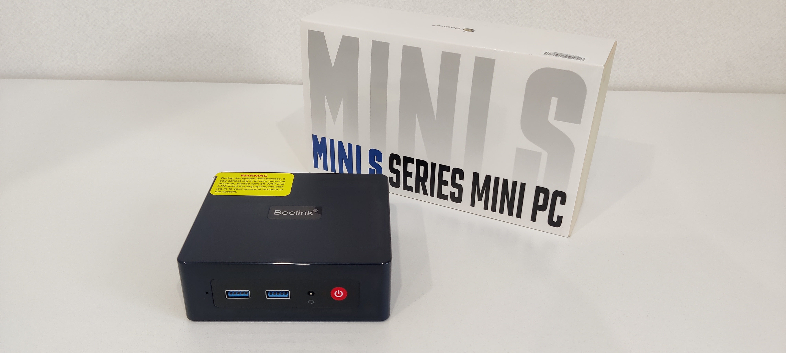

 

И да, я купил мини ПК, но вовремя понял, что мини пк + DAS мне не подойдет. Хоть недорогой мини ПК и на архитектуре x86, он все равно будет слабым по производительности + высокие температуры в таком маленьком корпусе. В том, что я брал стоял Intel N5095 и 8GB RAM. Подключать диски по USB не хотелось. Ну и выглядело бы это не так аккуратно, как я бы хотел. Мини ПК был продан. Я решил собирать NAS сам, брать бу железо я не планировал, даже с учетом нового железа, сборка будет дешевле и сильно мощнее чем в готовых NAS, а также можно будет легко заменить любой компонент.

## DYI NAS

Самое первое с чего стоит начать это корпус. Он должен вмещать в себя много HDD 3.5 дисков. Мне порекомендовали Jonsbo N4. В него можно поставить 8 дисков (6x 3.5, 2x 2.5), Карл! Производитель позиционирует решение, как раз для сборок под NAS. А еще он выглядит стильно на мой взгляд и достаточно компактный.

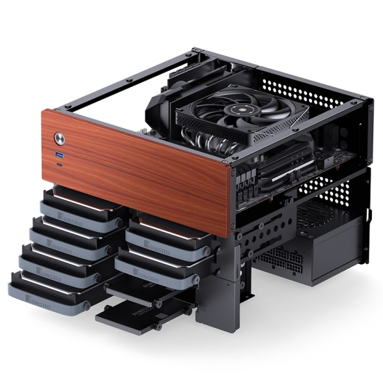

 

Блок питания и материнскую плату я взял просто качественные. CPU Intel Core i3 12100 4 core, 8 threads. Более производительный CPU я не вижу смысла пока ставить. 16 GB RAM, 240 GB SSD NVMe под систему, башенный кулер ну и пара дисков Seagate IronWolf 4TB. У меня еще был старый HDD от Western Digital на 750GB, которому уже много лет. Но и его можно использовать.

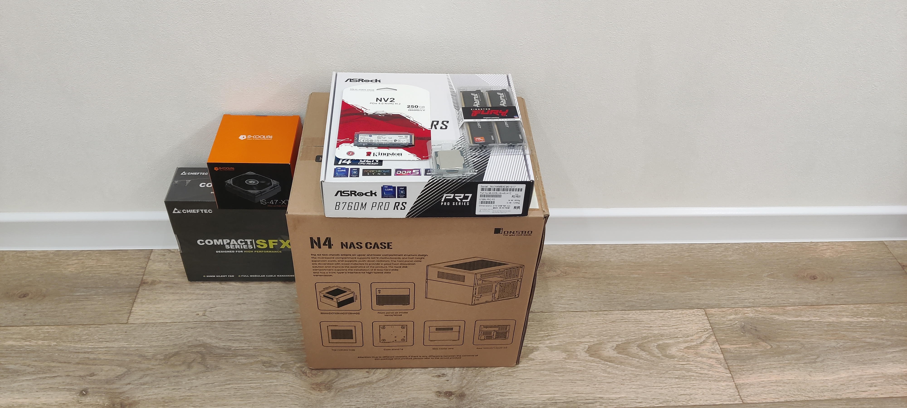

Диски приехали позже

 

Собрал за вечер, никаких сложностей в процессе не было.

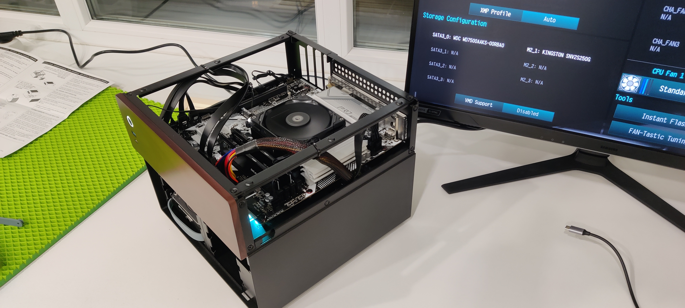

 

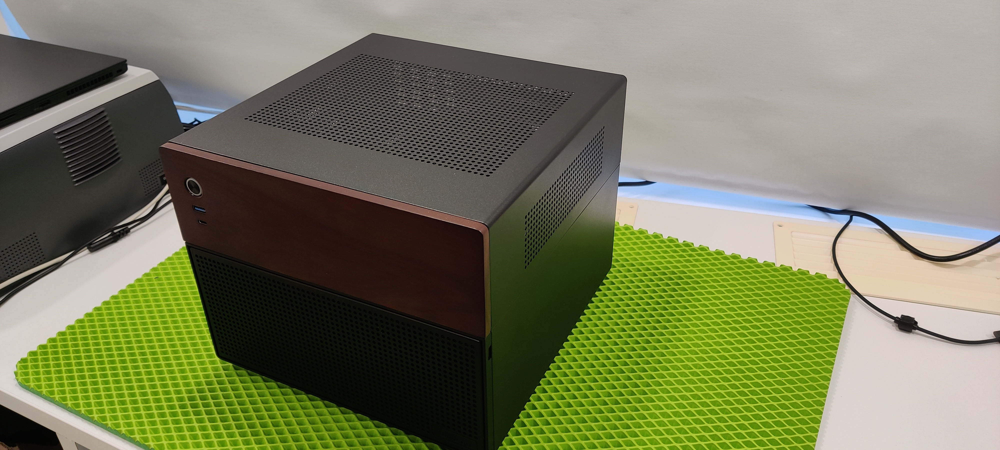

 

По температурам CPU все было супер, кулера более чем хватало. Но когда я установил все диски, то заметил, что температура дисков высоковата для работы в режиме 24/7. А я планирую еще ставить диски...

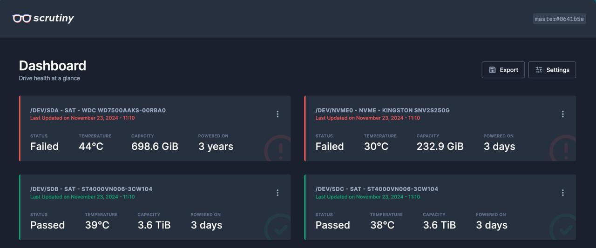

 

Проблема этого корпуса на мой взгляд в том, что если поставить все 8 (а я поставил пока только 3) дисков, то они будут выделять тепло, которое плохо вытягивает задний вентилятор. На Reddit нашел пост, где была такая же проблема с высокими температурами дисков. В комментариях один пользователь рассказал, как он решил эту проблему. Он спроектировал и распечатал на 3D принтере панель на котороую можно установить 2 вентилятора на вдув и они будут охлаждать диски. И это никакой не колхоз, все выглядит красиво и крепиться на магнитах. Я заказал на Авито печать самой панели, заказл 2 кулера и набор магнитов. Через пару дней все было готово. После сборки и установки это выглядит вот так (снял крышку для фото)

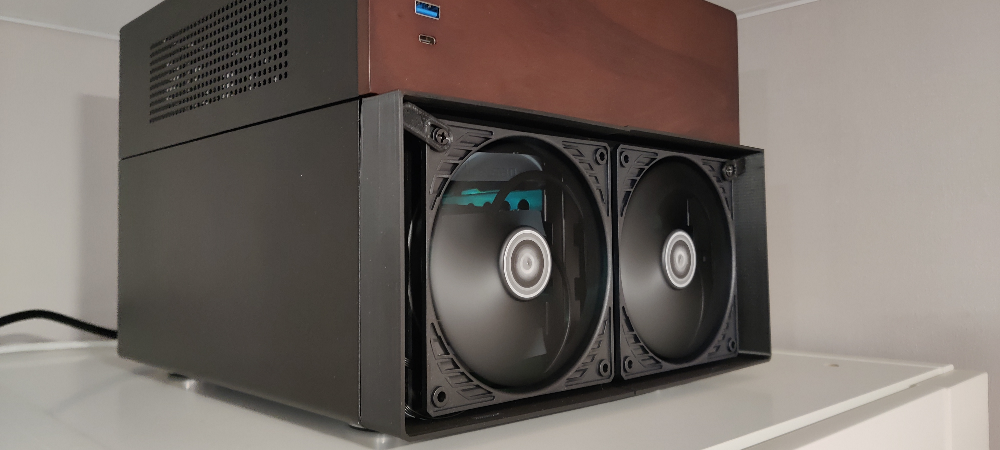

 

После установки панели с доп. охлаждением, температуры упали.

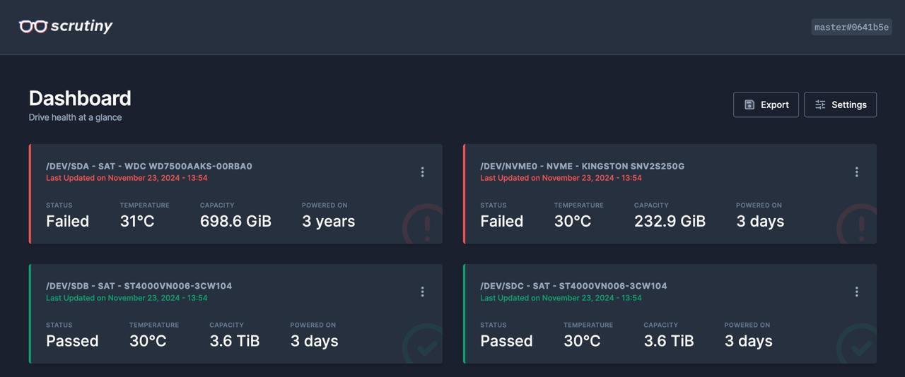

 

В качестве операционной системы я выбрал Ubuntu Server, я с ней хорошо знаком, есть много гайдов и софта. Сделал программный RAID 1 из двух дисков по 4TB для важных данных. Все остальное, что нежалко потерять храню на старом диске, как он помрет, возьму, наверное тоже что-то от Western Digital. Сейчас NAS стоит в прихожей и не занимает места. К нему я планирую еще купить ИБП, больше для того, чтобы он выключался безопасно и затем включался при появлении питания. Это же все таки сервер, он должен жить с минимальным вмешательством с моей стороны.

Немного расскажу про мои сценарии использования. Во первых доступ к серверу есть извне, это очень круто. Во вторых я перенес все свои данные и данные близких из Google, все храниться теперь на нем. Фильмы/сериалы теперь можно смотреть через свой собственный стриминг где угодно и на чем угодно. И управлять процессом хоть со смартфона. Слушать свою коллекцию треков со школьных времен в любое время. Настроил регулярный бэкап через TimeMachine по сети, это гораздо удобнее чем бегать с внешним диском к ноутбуку. Вообще имея домашний сервер можно делать много интересного и решать разные задачи.

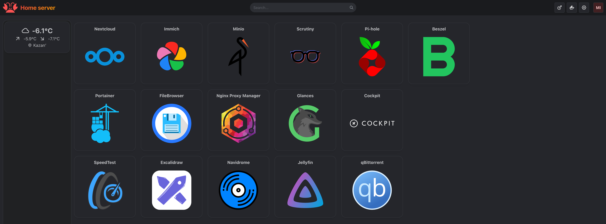

 

## F.A.Q.

1. **Зачем в 2024 году HDD, есть же SSD?**\
    Скорость SSD избыточна, если только у вас нет 10 Gbit'ной сети, в лучшем случае у вас 1Gbit, а это 125 мбайт. Скорость HDD дисков где-то 200 мбайт. И 125 мбайт не будет даже по проводу (я максимум смог получить 111 мбайт). Цена за гигабайт у HDD все еще ниже чем у SSD, 2 HDD диска по 4 TB можно купить дешевле чем 1 SSD на 4 TB. Ну и важно понимать вид нагрузки, если часто происходит перезаписть, то SSD здесь не подойдет.

2. **Безопасно ли так хранить свои данные?**\
    Безопасное хранение достигается зеркалированием дисков (см. RAID 1). Регулярными бэкапами. В идеале по стратегии [3-2-1](https://www.backblaze.com/blog/the-3-2-1-backup-strategy/). Да, всегда что-то может пойти не так, но если все делать правильно, то шанс потерять свои данные не сильно выше чем потерять их в облаке. Я сделал RAID 1 на случай, если один из дисков выйдет из строя и делаю регулярные бэкапы на внешний диск. В будущем я куплю готовый недорогой NAS, поставлю его вообще в другой дом/город и буду делать дополнительно бэкапы и на него.

3. **Есть смысл переплачивать за готовый NAS?**\
    Да, есть. Вы получаете готовое решение, вам не надо заморачиваться с выбором и сборкой железа, где можно допустить ошибку. Не надо настраивать ОС и софт. Если хочется получить свое персональное облако здесь и сейчас не теряя время, то лучше заплатить и купить готовое решение, оно того стоит.

4. **Почему в качестве ОС не выбрал TrueNAS, Xpenology, OpenMediaVault?**\
    На мой взгляд эти ОС создавались под определенную задачу и возможно решают ее хорошо, но я не хотел быть ограничен ею и мне комфортнее взять general purpose OS и настроить все, что мне необходимо с нуля.

5. **Почему RAID 1 программный, а не аппаратный?**\
    Материнская плата в моем NAS поддерживает аппартный RAID 1, но в случае ее выхода из строя, мне придется искать точно такую же материнскую плату, чтобы восстановить работу RAID. Программный RAID 1 позволяет независеть от железа.

6. **Почему не собрал из БУ железа?**\
    Не хотел тратить время на поиск, ну и бу железо это такое, никогда не знаешь, где выстрелит. Но если очень хочется и понятны все риски, то почему да.